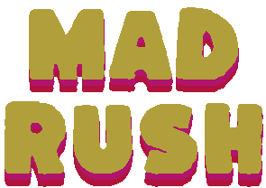

# Mad Rush

<!-- PROJECT LOGO -->
 

  

<!-- TABLE OF CONTENTS -->

  
Table of Contents

  <ol>
    <li>
      <a href="#about-the-project">About The Project</a>
      <ul>
        <li><a href="#built-with">Built With</a></li>
      </ul>
    </li>
    <li><a href="#controls">Controls</a></li>
    <li><a href="#acknowledgments">Acknowledgments</a></li>
  </ol>

## About the Project

Created for Core Mechanics Challenge

First attempt at creating a 3D game in Godot and first time actually trying to submit something.

My focus for this game was to work on understanding building games in 3D and try to make as much terrain generation random as I could. In an attempt to make it more visually interesting I tied some of the environmental effects to the music.

Given obstacles are placed randomly it can lead to some extremely difficult or sometimes impossible manuevers. I have done my best to stamp out the latter given the time constraints.

<a href="https://finalsabbath.itch.io/mad-rush">Play it here</a>

## Built with

- Game Engine - Godotgit
- Graphics - Aesprite, GIMP

## Controls

- **Move Left** | A, ←, Joypad left stick left, Joypad D-Pad left
- **Move Right** | D, →, Joypad left stick right, Joypad D-Pad right
- **Jump** | Space, Joypad Button 0

## Acknowledgments

- ExploreGameDev for terrain belt design for 3D runner : https://youtu.be/1jNt91A2PW0?si=0WCnfxj0mGUR-A9b
- Abstraction for music : https://tallbeard.itch.io/music-loop-bundle
- Prinbles for art assets : https://prinbles.itch.io/silent
- GGBotNet for fonts : https://www.ggbot.net/fonts/
